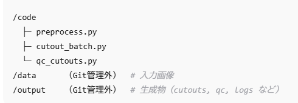
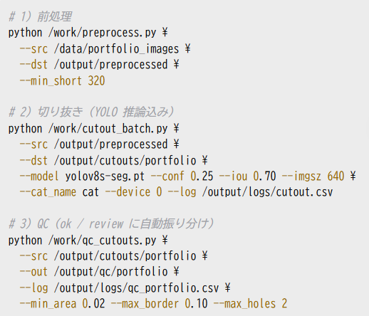
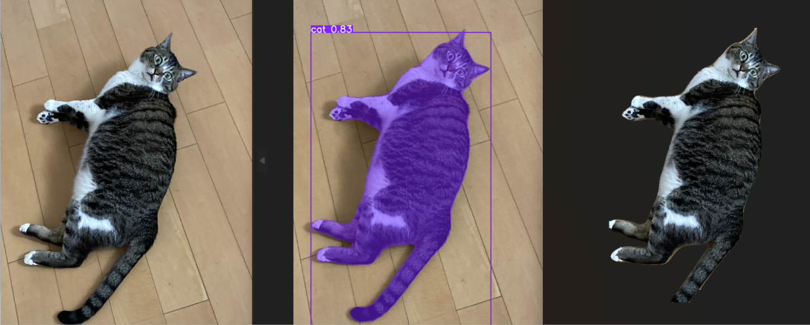

# ポートフォリオ
このページは、私が作成したAI・画像分類・3D作品などを紹介するポートフォリオです。 
私は独学でプログラミングを学習しています。Python開発とツール作成において、ChatGPT、Claude、Geminiなどの生成AIを積極的に活用しています。 

# 開発アプローチ
- 企画段階：各AIと相談しながら「何を作成したいか」を明確化
- 実装段階：AIにコード生成を依頼後、自分でコード内容を確認・理解
- 改善段階：目的通りの動作になるまで試行錯誤を重ね、完成度を高める

# 具体的な活用事例
- 犬猫分類プロジェクトでは、ResNet50転移学習モデルで期待した精度が得られなかった際、3つのAI（ChatGPT・Claude・Gemini）の力を借りて原因分析を行い、最終的に問題を解決して完成させました。
- 猫の切り抜きツールでは、主にChatGPTを使用してコード作成を進め、不明な点についてはClaudeから詳細な解説やアドバイスを受けて理解を深めました。

## プロジェクト一覧
- [犬猫画像分類モデル](https://github.com/suzuki2n/catdog288/tree/main)
- [猫の自動切り抜き](https://github.com/suzuki2n/YOLO_cats.git)

## 現在作成中です

## ディープラーニング画像分類モデル（猫・犬）
- 目的：犬・猫の2分類を高精度で実現し、学習～評価の実験設計力を身につける。
- 犬猫分類AIモデル  
- 使用技術：TensorFlow, CNN, 転移学習（ResNet50 + Fine-tuning）  
- 精度：精度98.9%

このプロジェクトでは、転移学習とファインチューニングを使い、犬猫分類の精度を最大98.9%まで向上させました。   
モデルやコード、実験ログ（.ipynb）も全て公開中です。   
このリポジトリは、犬猫画像分類の転移学習プロジェクトの記録です。   
最終的に ResNet50＋Fine-tuning により **精度98.9%** を達成しました。 

- このリポジトリに含まれるもの  
catdog_model_128.ipynb（CNNモデル） 
catdog_model_224.ipynb（CNNモデル） 
catdog_model_ResNet50_BATCH12_224.ipynb（実験中精度訳63％のモデル） 
catdog_model_ResNet50_BATCH16_224.ipynb（実験中精度訳63％のモデル） 
catdog_model_VGG16_BATCH8_224.ipynb（VGG16モデル精度93％） 
catdog_model_VGG16_BATCH16_224.ipynb（VGG16モデル精度93％） 

**完成モデル**  
catdog_model_ResNet50_BATCH16_FT2_224.ipynb（精度98.9％） 

img_resize.py（データセット用画像の前処理ツール） 
mkdir_learning.py（データセット用フォルダの作成ツール） 
perform_classification.py（モデルを実際の画像で実行、画像を分類保存するツール） 

## 猫の自動切り抜き（YOLOv8-seq + OpenCV）
### 概要
- 目標：大量の画像から猫だけを抽出し、透過PNGを自動生成
- 学習目的：YOLOの実装手順とDockerの使い方を習得
- 技術：Ultralytics YOLOv8-seg（推論のみ / 学習なし）＋ OpenCV。
- システム構成：前処理→推論→切り抜き→QCの完全バッチ処理
- 開発環境：Docker、ubuntu
- 品質管理：仕上がり判定のためのQCツールを実装

### 学習内容
- WSL2 + Docker + GPU での環境構築・運用
- VS Code の Dev Containers でコンテナ内での開発・実行
- 画像前処理（縮小/拡大、CLAHE、軽いシャープ）

### 手順
- preprocess.py：小さい画像を拡大、低コントラストを CLAHE で補正
- cutout_batch.py：YOLOv8-seg 推論 → マスク合成 → 透過 PNG 保存（穴が大きい/マスク無は GrabCut 保険）
- qc_cutouts.py：品質判定をする。面積・端接触・穴・連結成分で ok / review を自動仕分け

#### 使用ファイル

#### 使い方

#### 実行結果

### 残された課題と今後の改善点
#### 低コントラスト画像への対応
- 課題：白猫×白背景などの低コントラスト画像でYOLO抽出時に猫の一部が欠ける
- 原因：境界の判別が困難なため、セグメンテーション精度が低下
#### 複数オブジェクトの処理
- 課題：多頭飼いや猫が重なった画像で抽出が不完全になる
- 影響：一部が欠けた状態での切り抜きが発生
#### エッジ処理の精度向上
- 課題：切り抜き境界でギザつきや背景の混入が発生
- 根本原因：YOLOは正しく猫を検出しているが、境界判別の限界により切り抜き品質が低下
- 連鎖的影響：不正確な切り抜きによりQCツールでの画像振り分けも不安定化

#### 今後の方向性
- 前処理段階でのコントラスト強化(試したけど上手くいかない)
- 後処理でのエッジ平滑化
- より高精度なセグメンテーションモデルの検討

### 切り抜き結果

- 飼い猫の画像

### ライセンス・権利
- モデル：Ultralytics を pip 依存／Docker 内で利用（AGPL への配慮として本体配布はしない）。
- 画像：Kaggle 画像は学習・検証のみ。公開画像 自撮り（飼い猫）画像のみを使用。

順次プロジェクト内容を整理し、追加していきます。 

## 3Dモデル・作品紹介
### 3D小道具：琴 
フォーマット：FBX形式 
使用シェーダー：Standard 
無料配布中（Booth） 
▶ [配布ページはこちら](https://suzuki2n.booth.pm/items/3971677)
はこちら 

### VRMアバター 
VRoid Hubにて公開中 
▶ [VRMモデルを見る](https://hub.vroid.com/characters/6889964990498381032/models/4232243861661725226)
 

